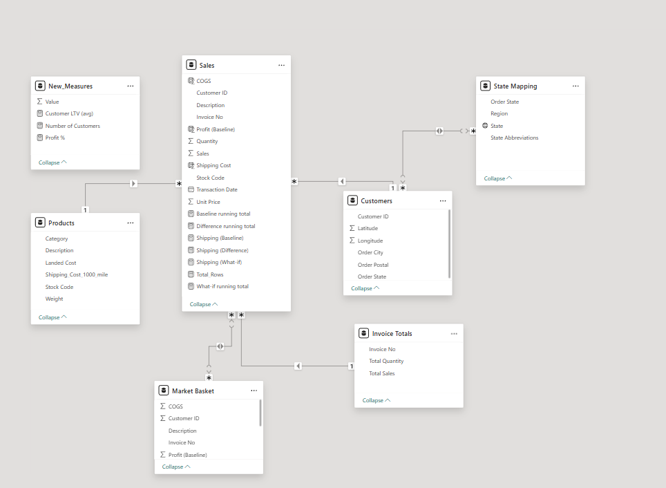
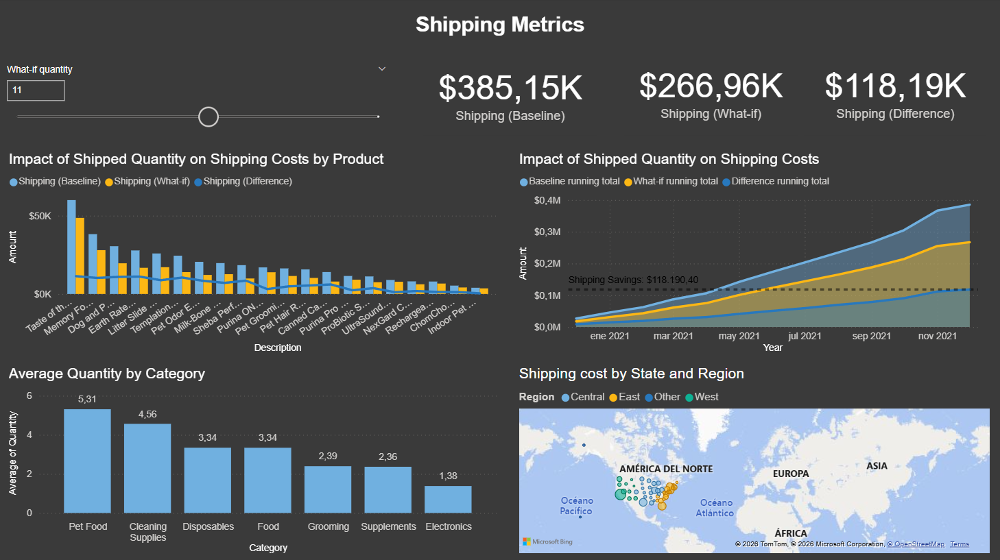

# 🛒 Whiskique E-commerce Analytics


**Turning pet store transaction data into a profit, shipping, and basket intelligence platform.**
End-to-end e-commerce analytics: star schema · COGS & profit modeling · What-if shipping scenarios · Market Basket Analysis.

**Related Project:** The same Whiskique's data set was analyzed using Python (Pandas + NetworkX) for graph-based market basket and product co-occurence analysis -> [View Python project](https://github.com/Datagroundr4)

---

## 🎯 Business Problem

Whiskique is a pet products e-commerce store operating across multiple U.S. regions.
The business needed to answers to three strategic questions that raw transactions data alone could not provide:

**This project answers:**
- Who are the top customers and what is their lifetime value?
- What are the company's actual profits after shipping and landed costs?
- How do shipping cost structures change under different order quantity scenarios?
- Which prodicts are frequently purchased together — and what does that mean for bundling strategy?

---

## 📁 Dataset & Data Model

### Snowflake Schema

The model follows a **snowflake schema** with `Sales` as he central fact table. `State Mapping` connects to `Customers` rather than directly to the fact table — a dimension-to-dimension relationship on `Order State` (many-to-many cardinality) that clasifies customers by U.S. region.



| Table | Type | Key Fields | 
|-------|------|------------|
| `Sales` | Fact | Transaction Date, Customer ID, Description, Stock Code, Invoice No, Sales, Unit Price, Quantity, Sales, Unit Price, Shipping cost |
| `Products` | Dimension | Stock code, Description, Category, Shipping_Cost_1000_mile, Landed Cost, Weight | 
| `Customers` | Dimension | Customer ID, Order State, Order City, Order Postal |
| `State Mapping` | Dimension (2nd level) | State, Region — connected to `Customers` via `Order State`, not directly to `Sales` |
| `Market Basket` | Duplicate of Sales | Created in Power Query for cross-visual filtering `Invoice No` |
| `What-if Quantity` | Parameter table | Integer 1-20, step — drives scenario modeling |

`New Measures` is a dedicated DAX measures table and does not form part of the data model relationships.

### Dataset Overview

| Attribute | Detail |
|-----------|--------|
| Source | Whiskique's pet store transactional data | 
| Records | 24,404 rows — unique transactions at item level |
| Unique invoices | 11,427 |
| Unique customers | 3,141 |
| Top state by customers | California (419 customers) |

### Data Preparation (Power Query) 
- Created a **grouped-by `Invoice No`** table from a duplicate of `Sales` to view aggregated totals for `Sales` and `Quantity` per transaction 
- Created the **`Market Basket`** table as a duplicate of `Sales`, establishing a new relationship on `Invoice No` to enable cross.visual product co-occurence filtering
- Applied type corrections and currency formatting to monetary columns

---

## 🔍 Key Findings

**Overall metrics:** Total customers: **3,141** · Avg Customer LTV: **\$494.72** · Shipping baseline: **$385.15K**
| Insight  | Business Implication |
|----------|----------------------|
| **Electronics** has the highest profit margin at **44.28%** | Prioritize electronics and inventory investment |
| Best-selling product: **Sheba Perfect Portions Pat Wet Cat Food** (avg qty 7.07) | Anchor product for bundles and loyalty programs |
| Lowest-selling product: **Indoor Pet Camera** | Review pricing placement or discontinuation |
| Highest shipping cost per 1,000 miles: **Taste of the Wild 40lb** ($20) | Offer free shipping threshold or weight-based surcharge |
| Lowest shipping cost per 1,000 miles: **Sheba Wet Cat Food** ($2.50) | Natural anchor for free shipping promotions |
| **California** holds the most customers (419) in the West region | Prioritize West region for retention and expansion campaigns |
| **Texas** leads Central, **New York** leads East, **Florida** leads East in total sales | Region-specific marketing budgets justified by data |
| Most frequent basket size: **2 items (7.22%)**, followed by 3 (6.68%) and 4 (6.52%) | Design bundle promotions for 2-4 item combinations |
| At What-if quantity **≥ 9**, blended shipping factor drops to **0.3** | Bulk order incentives could shift customers to higher quantities and reduce per-unit shipping costs |
| Average Customer LTV of **$494.72** | Benchmark for customer acquisition cost ceiling and retention investment |

---

## 📊 Dashboard 

🔗 **[View Live Dashboard](https://app.powerbi.com/view?r=eyJrIjoiODA2NzA5ZGEtNTk3Mi00ZjI0LWJkY2UtMDgwNDczYWMwNjYwIiwidCI6IjRkYTFiNTk3LTkyOGEtNGVkZi04Y2MwLTcwMmFiNjA1NjYyMSIsImMiOjR9)**



The report is structured across **3 pages**, each serving a distinct analytical purpose:

| Page | Audience | Purpose | Key Visuals | 
|------|----------|---------|-------------|
| **Executive Summary** | Leadership / Commercial | Top-line performance overview | KPI cards: Total Sales · Total Profit · Profit % · Shipping Baseline · GlobeMap: Total Sales by State · Treemap: Profit % by Category · Bar Chart: Total Sales by Product & Category · Product Slicer |
| **Shipping Metrics** | Operations / Finance | Scenario modeling for shipping cost optimization | KPI cards: Baseline · What-if · Difference · What-if Quantity slicer · Combo Chart: Baseline vs. What-if by Product · Area chart: Running total comparison over time · Column chart: Avg Quantity by Category · Map: Shipping cost by State and Region |
| **Market Basket Analysis** | Commercial / Merchandising | Product co-occurrence and bundling intelligence | Interactive table: Product Description filter · Bar chart: Combination of Purchased Items · Combo chart: Total Sales and Profit % by Description |

### Design Decisions
- Applied the **Innovate** theme — a corporate palette in blues and golds (`#70B0E0`, `#FCB714`, `#2878BD`) — chosen for professional readability and brand-neutral presentation
- The **Market Basket** cross-visual interaction (table -> bar chart) was implemented by creating a duplicate `Sales` table with an `Invoice No` relationship — enabling click-to-filter without modifying the core data model

---

## 🛠️ Technical Approach

### DAX Calculated Columns

```dax
-- Cost of goods sold: quantity x landed cost from Products dimension
-- Uses RELATED() to pull data across the snowflake schema relationship
COGS = Sales[Quantity] * RELATED(Products[Landed Cost])

-- Profit Before tax: revenue minus COGS minus baseline shipping
Profit (Baseline) = Sales[Sales] - Sales[COGS] - [Shipping (Baseline)]
```

### DAX Measures

```dax
-- Customer lifetime value: total revenue divided by unique customer count
Cutomer LTV (avg) = SUM(Sales[Sales]) / [Number of Customers]

-- Profit margin as a percentage of total revenue 
Profit % = SUM(Sales[Profit (Baseline)]) / SUM(Sales[Sales])

-- Baseline shipping: base cost for 1 item; each additional unit adds 70%
Shipping (Baseline) = SUMX(
    Sales, IF(
        Sales[Quantity] = 1,
        Sales[Shipping Cost], 
        Sales[Shipping Cost] + (((Sales[Quantity]) - 1) * Sales[Shipping Cost] * 0.7)
    )
)

-- What-if shipping: same logic but uses the dynamic blended factor
-- from the What-if Quantity parameter instead of a fixed 0.7
Shipping (What-if) = SUMX(
    Sales, IF(
        Sales[Quantity] = 1,
        Sales[Shipping Cost], 
        Sales[Shipping Cost] + (((Sales[Quantity]) - 1) * Sales[Shipping Cost] * [Blended Shipping Cost Factor])
    )
)

-- Tiered discount factor driven by the What-if Quantity parameter
Blended Shipping Cost Factor = IF(
    'What-if Quantity'[What-if quantity Value] <= 1, 1,
    IF('What-if Quantity'[What-if quantity Value] <= 2, 0.8,
    IF('What-if Quantity'[What-if quantity Value] <= 4, 0.6,
    IF('What-if Quantity'[What-if quantity Value] <= 7, 0.5,
    IF('What-if Quantity'[What-if quantity Value] <= 9, 0.4, 0.3
    )))))

-- Cummulative baseline shipping across all dates up to the current max
-- ALLSELECTED preserves user-applied filters while overriding date context
Baseline Running Total = SUMX(
    FILTER(
        ALLSELECTED(Sales),
        Sales[Transacton Date] <=  MAX('Market Basket'[Transaction Date])
    ),
    [Shipping (Baseline)]
)

-- Same pattern  aplied to What-if scenario for direct comparison
What-if running total = SUMX(
    FILTER(
        ALLSELECTED(Sales),
        Sales[Transaction Date] <= MAX('Market Basket'[Transaction Date])
    ),
    [Shipping (What-if)]
)

-- Cummulative difference between baseline and What-if over time
Difference running total = SUMX(
    FILTER(
        ALLSELECTED(Sales),
        Sales[Transaction Date] <= MAX('Market Basket'[Transaction Date])
    ),
    [Shipping (Difference)]
)
```

### Why Running Totals Use SUMX + FILTER + ALLSELECTED

Standard `CALCULATE` with date intelligence would reset on each row context.
The `SUMX(FILTER(ALLSELECTED(...)))` pattern ensures the measure:
1. Respects any user-applied filters (`ALLSELECTED`)
2. Accumulates all values from the beginning of time up to the current date in context
3. Works correctly across both the `Sales`and `Market Basket` table contents

This is the correct pattern for cummulative comparison charts where two measures (baseline vs. scenario) must be evaluated on the same time axis.

---

## 💡 Skills Demonstrated

`Power BI` `DAX` `Power Query` `Star Schema` `What-if Analysis` `Scenario Modeling` `Market Basket Analysis` `COGS Modeling` `Profit Analytics` `Running Totals` `RELATED()` `ALLSELECTED` `Custom Visuals` `E-Commerce Analytics` `Shipping Cost Optimization` `KPI Design` `Data Storytelling`

---

## 📂 Repository Structure

```
whiskique_ecommerce_analytics/
├── README.md
├── dashboard/
│   ├── overview.png
│   ├── shipping_metrics.png
│   ├── market_basket.png
│   └── data_model.png
└── insights/
    └── executive_summary.md
```

---

## Portfolio & Contact

|  |  |
|----|----|
| 🌐 Portfolio | [linktr.ee/dataground](https://linktr.ee/dataground) |
| 💼 LinkedIn | [Juan Fernando Mosquera](https://www.linkedin.com/in/juan-fernando-mosquera-araujo-226966180/) |
| ✍️ Medium | @erre4tro](https://medium.com/@erre4tro) |

---

*Part of the [Datagroundr4](https://github.com/Datagroundr4) analytics portfolio.*

---

